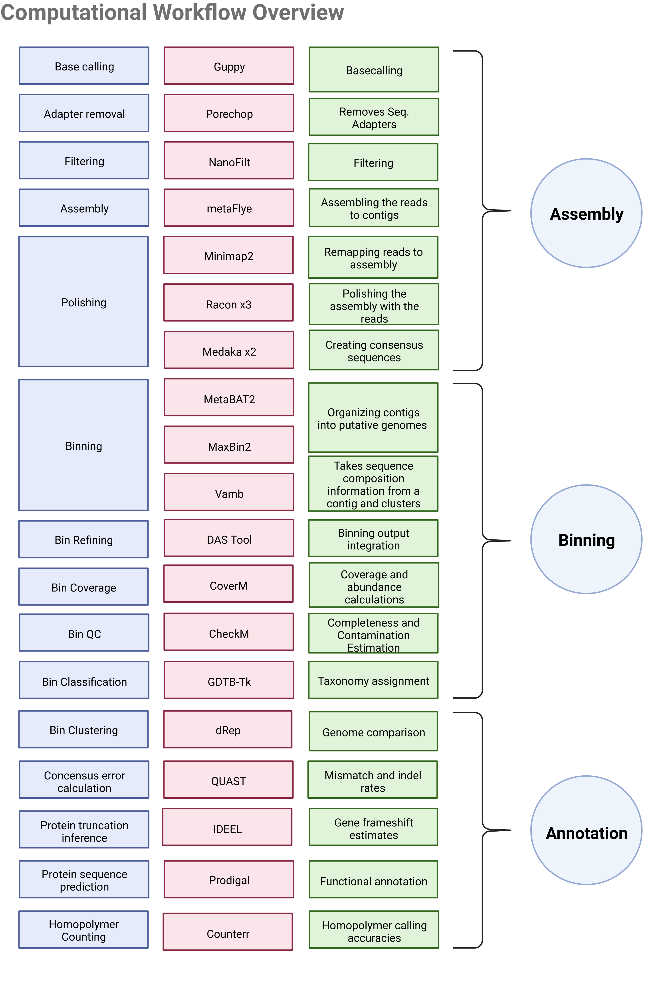

# Air_Metagenomics

# Nanopore Sequencing Data Analysis Pipeline

This repository contains a pipeline for the analysis of Oxford Nanopore sequencing data. The pipeline uses the following tools:

1. **Guppy Basecaller**: This software tool, provided by Oxford Nanopore Technologies (ONT), is used to convert the raw electrical signal data from nanopore sequencing into DNA sequences, a process known as basecalling.

2. **Porechop**: This tool is developed for Oxford Nanopore sequencing data. It finds and removes adapters from Oxford Nanopore reads.

3. **NanoFilt**: This is a simple tool to filter Oxford Nanopore sequencing data. It reads in a FASTQ file (or stdin), filters reads based on a minimum quality and/or a minimum length, and writes out the filtered reads to stdout.

4. **Flye**: This is a de novo assembler for single-molecule sequencing reads, such as those produced by PacBio and Oxford Nanopore Technologies. It can be run in 'meta' mode for metagenomic projects.

5. **Minimap2**: This tool serves as an aligner for bio-sequences. In the context of nanopore sequencing, it aligns the raw nanopore reads to the assembled sequences produced by Flye. The `-ax map-ont` option specifies that the input data is Oxford Nanopore reads. The output is a BAM file sorted by samtools.

6. **Racon**: It is a tool that performs consensus sequencing. It takes as input the raw nanopore reads, and the alignment file produced by Minimap2, and the assembly produced by Flye, and then it generates a consensus sequence that represents an 'improved' version of the initial assembly. This step is also known as 'polishing' the assembly.

7. **Concoct**:

8. **MaxBin2**: MaxBin is an automated binning program to recover individual genomes from metagenomes using an Expectation-Maximization algorithm. This tool groups contigs into individual species based on nucleotide composition and read coverage.

9. **MetaBat2**: MetaBAT is an efficient tool designed to automatically group large genomic fragments assembled from metagenomic shot-gun sequencing. MetaBAT uses a variety of features to group contigs into bins representing individual species.

10. **DAS Tool**: DAS Tool is an automated method that integrates the results of a flexible number of binning algorithms to calculate an optimized, non-redundant set of bins from a single assembly. In this pipeline, it takes the binning results from Vamb, MaxBin2, and MetaBat2 to generate a consolidated and optimized set of bins.

11. **CoverM**: CoverM aims to be a configurable, easy to install, and computationally efficient tool to calculate coverage from mapped metagenomic reads to genomes. It calculates the coverage of the contigs, which can be used to estimate the relative abundance of the species in the sample.

12. **CheckM**: CheckM provides a set of tools for assessing the quality of genomes recovered from isolates, single cells, or metagenomes. It uses lineage-specific marker sets to assess genome completeness and contamination. It provides robust estimates of genome completeness and contamination by using collocated sets of genes that are ubiquitous and single-copy within a lineage.

13. **Quast**: Quast (QUality ASsessment Tool) evaluates and reports on the quality of genome assemblies. It provides statistics such as the number of contigs, the N50 statistic, GC content, and more. The input to Quast is the binned contigs from Vamb.

14. **Kraken 2**: This is a system for assigning taxonomic labels to short DNA sequences. It's generally used in metagenomics projects to identify the species present in a sample. The input to Kraken 2 is the binned contigs from Vamb.

15. **Prodigal**: Prodigal (PROkaryotic DYnamic programming Gene-finding ALgorithm) is a microbial gene prediction program. It predicts protein-coding genes in the contigs. The input to Prodigal is the binned contigs from Vamb.

16. **DIAMOND**:  

