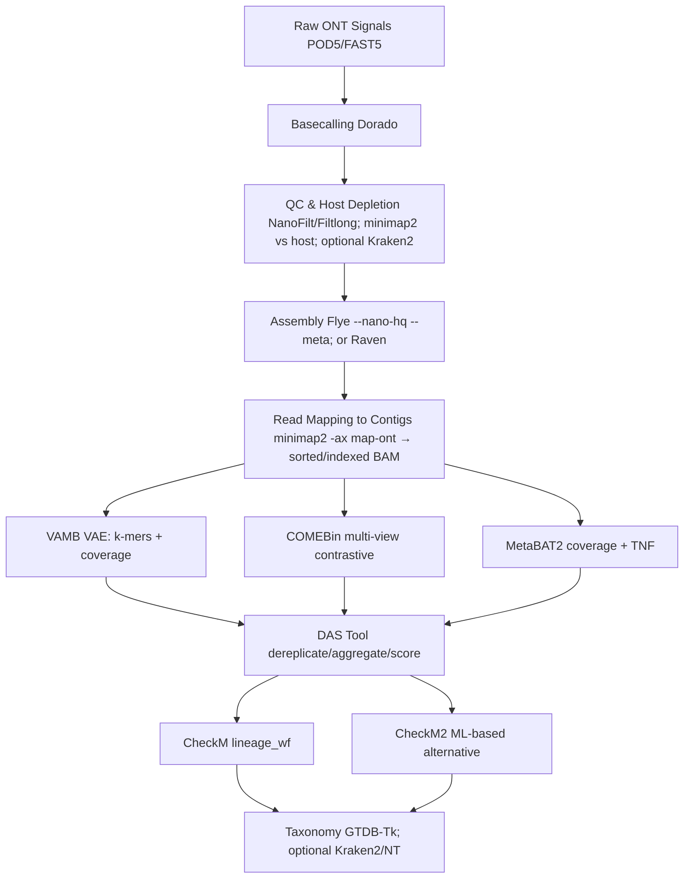

# Binning Nanopore Metagenomes with VAMB, COMEBin, MetaBAT2, DAS Tool, and CheckM

A reproducible, end-to-end workflow for Oxford Nanopore metagenomes: upstream preparation, binning with VAMB, COMEBin, and MetaBAT2, refinement with DAS Tool, quality assessment with CheckM (and CheckM2), and taxonomic assignment with GTDB-Tk (optional Kraken2). Commands are current for modern ONT pipelines (e.g., Flye --nano-hq; Dorado --emit-fastq) and emphasize methodological clarity, reproducibility, and interpretability.

Assumptions. ONT R9/R10 data, basecalled with Dorado (hac or sup). Assemblies via Flye/metaFlye in metagenome mode. Mapping with minimap2 preset -x map-ont. Prefer Flye --nano-hq for contemporary, high-quality (Q≈20) basecalls; use --meta for metagenomes. Reserve --nano-raw for older, noisier reads.

⸻



⸻

## 0) Environment and channels

```bash
# One-time channel setup
conda config --add channels conda-forge
conda config --add channels bioconda
conda config --add channels defaults
```

⸻

## 1) Upstream processing

### 1.1 Basecalling (Dorado)

Dorado writes BAM to stdout by default; use `--emit-fastq` to emit FASTQ. Select a model (fast, hac, or sup) and point to your POD5/FAST5 location.

```bash
# Basecall to FASTQ (GPU, SUP model)
dorado basecaller sup pod5_dir/ --emit-fastq -x cuda:0 > reads.fastq

# Recursively traverse nested directories if needed
dorado basecaller hac /data --recursive --emit-fastq -x cuda:0 > reads.fastq
```

### 1.2 Read quality control and length filtering

```bash
# Retain reads ≥1 kb and mean qscore ≥10
cat reads.fastq | NanoFilt -q 10 -l 1000 > reads_qc.fastq
```

(Optional) Long-read subsampling/quality trimming with Filtlong can be applied prior to assembly if coverage is excessive.

### 1.3 Host depletion (recommended for host-associated samples)

Align against a host reference and keep unmapped reads. Use the ONT preset.

```bash
minimap2 -t 32 -ax map-ont host.fa reads_qc.fastq \
  | samtools view -b -f 4 \
  | samtools fastq -@ 8 - > reads_filtered.fastq
```

### 1.4 Assembly (Flye/metaFlye)

Use `--nano-hq` for high-quality ONT reads and `--meta` for metagenomes. For older, low-accuracy reads, use `--nano-raw`.

```bash
flye --nano-hq reads_filtered.fastq --meta \
     --out-dir flye_out --threads 32
# If necessary for atypical error profiles on HQ data:
# flye --nano-hq reads_filtered.fastq --meta --read-error 0.03 --out-dir flye_out --threads 32
```

(Alternative) Raven can be substituted for Flye in constrained environments.

### 1.5 Read mapping to contigs and depth calculation

Map reads back to the assembly; produce a sorted, indexed BAM. Generate a depth matrix for MetaBAT2 using one or more BAMs.

```bash
minimap2 -t 32 -ax map-ont flye_out/assembly.fasta reads_filtered.fastq \
  | samtools sort -o mapping.bam
samtools index mapping.bam

# Depth table for one or many sorted BAMs
jgi_summarize_bam_contig_depths --outputDepth depth.txt mapping.bam
# For multiple samples (recommended to strengthen covariance):
# jgi_summarize_bam_contig_depths --outputDepth depth.txt mappings/*.bam

# If basecalls are not HQ (older chemistries), optionally relax identity:
# jgi_summarize_bam_contig_depths --percentIdentity 95 --outputDepth depth.txt *.bam
```

⸻

## 2) VAMB

Concept. Variational autoencoder integrating k-mer composition and multi-sample coverage; strong performance on cohort data.

### 2.1 Installation

```bash
mamba create -n vamb -c conda-forge -c bioconda vamb
conda activate vamb
# or:
# pip install vamb

# (Optional for abundance estimation) Install strobealign for --aemb:
mamba install -n vamb -c bioconda strobealign
```

### 2.2 Inputs and run

Abundances can be prepared with strobealign’s `--aemb` and merged via VAMB’s helper scripts. If the helper scripts are not on your `PATH`, clone the VAMB repository or adjust the paths accordingly.

```bash
# Concatenate assemblies and rename contigs to VAMB’s scheme
python src/concatenate.py contigs.fna.gz flye_out/assembly.fasta

# Generate abundance tables (per sample)
mkdir -p aemb
strobealign -t 16 --aemb contigs.fna.gz sample1.fastq.gz > aemb/sample1.tsv
# Repeat for additional samples...

# Merge AEMB outputs into a single abundance table
python src/merge_aemb.py aemb abundance.tsv

# Run VAMB
vamb bin default \
  --outdir vambout \
  --fasta contigs.fna.gz \
  --abundance_tsv abundance.tsv \
  --minfasta 200000 \
  -m 2000 \
  -p 16
```

Key parameters. `--minfasta` (minimum total bin size to output), `-m` (minimum contig length), `-p` (threads), `--cuda` (use GPU), `--seed` (reproducibility).


## 3) COMEBin

Concept. Contrastive multi-view learning with augmented contig representations integrating k-mer and coverage features.

### 3.1 Installation (CPU example)

This guide describes how to process and bin nanopore metagenomes with **VAMB**, **COMEBin**, **MetaBAT2**, **DAS Tool**, and **CheckM**. It covers upstream preparation, installation steps, recommended flags, bin refinement, and downstream classification.

```mermaid
flowchart TD
    A[Raw Nanopore Signals] --> B[Basecalling\\n(Dorado, Guppy)]
    B --> C[QC & Host Removal\\n(NanoFilt, Filtlong, Kraken2)]
    C --> D[Assembly\\n(metaFlye, Raven)]
    D --> E[Read Mapping\\n(minimap2 -> BAM)]
    E --> F[VAMB]
    E --> G[COMEBin]
    E --> H[MetaBAT2]
    F & G & H --> I[DAS Tool\\nRefined Bins]
    I --> J[CheckM\\nCompleteness & Contamination]
    J --> K[Classification\\n(GTDB-Tk, Kraken2/NT)]
```

## 1. Upstream processing
1. **Basecalling**: convert raw electrical signals to FASTQ using tools like [`dorado`](https://github.com/nanoporetech/dorado) or `guppy`:
   ```bash
   dorado basecaller dna_r9.4.1_e8.1_hac@v3.5.2 fast5/ > reads.fastq
   ```
2. **Quality control and host removal**:
   - Filter low-quality reads:
     ```bash
     nanofilt -q 10 -l 1000 reads.fastq > reads_qc.fastq
     ```
   - Remove host contamination if necessary:
     ```bash
     minimap2 -ax map-ont host.fa reads_qc.fastq | \
       samtools view -b -f 4 -o reads_filtered.bam
     samtools fastq reads_filtered.bam > reads_filtered.fastq
     ```
3. **Assembly**: assemble long reads with `metaFlye` or `Raven`:
   ```bash
   flye --nano-raw reads_filtered.fastq --meta --out-dir flye_out --threads 32
   ```
4. **Read mapping and depth calculation**: map reads to contigs and compute coverage:
   ```bash
   minimap2 -ax map-ont flye_out/assembly.fasta reads_filtered.fastq | \
     samtools sort -o mapping.bam
   samtools index mapping.bam

   # depth file for MetaBAT2
   jgi_summarize_bam_contig_depths --outputDepth depth.txt mapping.bam
   ```

The resulting `mapping.bam` (and `depth.txt` for MetaBAT2) provide coverage information for subsequent binning.

## 2. VAMB
### Installation
VAMB is available through Bioconda or pip:
```bash
# with conda
mamba create -n vamb -c conda-forge -c bioconda vamb
# or via pip
pip install vamb
```

### Usage
Prepare abundance tables from BAM files and run `vamb`:
```bash
# concatenate assemblies and rename contigs (script provided by vamb)
python src/concatenate.py contigs.fna.gz asm_1/contigs.fasta asm_2/contigs.fasta

# generate abundance TSV from --aemb mapping outputs
python src/merge_aemb.py aemb abundance.tsv

# run VAMB
vamb bin default --outdir vambout --fasta contigs.fna.gz --abundance_tsv abundance.tsv
```
Important flags:
- `--outdir`: directory for output bins.
- `--fasta`: concatenated contig file.
- `--abundance_tsv`: table of per-sample coverages.
- Add `--minfasta` to set minimum bin size and `--mincontig` to set minimum contig length.

## 3. COMEBin
### Installation
Install via Bioconda (CPU-only example):

```bash
conda create -n comebin_env
conda activate comebin_env
conda install -c conda-forge -c bioconda comebin
```

(GPU) Install a CUDA-enabled PyTorch in the environment according to your CUDA toolkit.

### 3.2 Preprocessing

Helper scripts generate BAMs and remove short contigs. Paths may vary depending on installation; adjust as needed.

```bash
# Generate BAMs by mapping reads to contigs (wrapper script)
bash COMEBin/scripts/gen_cov_file.sh -a flye_out/assembly.fasta -o bam_dir reads/*.fastq

# Filter contigs < 1000 bp for stability
python COMEBin/scripts/Filter_tooshort.py flye_out/assembly.fasta 1000
```

### 3.3 Run

```bash
# Bioconda installs run_comebin.sh on PATH in many setups; otherwise call the script explicitly
run_comebin.sh \
  -a flye_out/assembly.fasta \
  -p bam_dir \
  -o comebin_out \
  -t 40 \
  -n 6
```

Key parameters. `-a` assembly FASTA; `-p` BAM directory; `-o` output directory; `-n` number of augmented views (default 6); `-t` threads; `-l` temperature for contrastive loss (e.g., 0.07 for N50 > 10 kb); `-b` batch size; `-e`/`-c` embedding dimensions.

⸻

## 4) MetaBAT2

Concept. Clusters contigs using tetranucleotide frequency (TNF) and coverage covariance; requires a depth matrix from BAMs.

### 4.1 Installation

```bash
# Preferred: Bioconda
mamba create -n metabat2 -c bioconda metabat2
conda activate metabat2

# Alternative build from source (if needed)
# git clone <metabat2 repo>
# cd metabat && mkdir build && cd build
# cmake .. && make
```

### 4.2 Depth and binning

```bash
# Depth across one or more sorted BAMs
jgi_summarize_bam_contig_depths --outputDepth depth.txt mapping1.bam mapping2.bam

# Binning
metabat2 -i flye_out/assembly.fasta -a depth.txt -o metabat_bins/bin -t 32 -m 2500
```

Useful switches. `-m` minimum contig length (default 2500); `--maxP`, `--minS`, `--maxEdges` for sensitivity/specificity; `--seed` for reproducibility; `--noAdd` to avoid adding small leftovers. The depth utility accepts `--percentIdentity` (default 97) to accommodate different read accuracies.

⸻

## 5) DAS Tool (bin refinement)

Concept. Integrates multiple bin sets into a non-redundant, higher-quality consensus by dereplication, aggregation, and scoring.

### 5.1 Installation

=======
For GPU acceleration install PyTorch with CUDA support as shown in the official README.

### Preprocessing
Generate BAM files from reads and filter short contigs:
```bash
bash gen_cov_file.sh -a contigs.fa -o bam_dir reads/*.fastq
python Filter_tooshort.py contigs.fa 1000
```

### Usage
Run COMEBin with the contig file and BAM directory:
```bash
bash run_comebin.sh -a contigs.fa -p bam_dir -o comebin_out -t 40
```
Key parameters:
- `-a`: assembly FASTA.
- `-p`: path to BAM files.
- `-o`: output directory.
- `-n`: number of augmented views (default 6).
- `-t`: threads.
- `-l`: temperature for contrastive loss.

## 4. MetaBAT2
### Installation
MetaBAT2 can be built from source or run via Docker. To build:
```bash
git clone https://bitbucket.org/berkeleylab/metabat.git
cd metabat
mkdir build && cd build
cmake .. && make
```
Alternatively, use the Docker image `metabat/metabat:latest`.

### Usage
MetaBAT2 expects a depth file generated from BAMs:
```bash
jgi_summarize_bam_contig_depths --outputDepth depth.txt mapping.bam
metabat2 -i assembly.fasta -a depth.txt -o bins/bin
```
Common flags:
- `-i`: input contigs.
- `-a`: depth file from `jgi_summarize_bam_contig_depths`.
- `-o`: output path for bins.
- `-m`: minimum contig length (default 2500 bp).
- `-s`: minimum bin size.
- `-t`: number of threads.
- `--minS`, `--maxP`, `--maxEdges`: advanced sensitivity/specificity controls.

## 5. DAS Tool
### Installation
Install via Bioconda:

```bash
mamba install -c bioconda das_tool
```

### 5.2 Prepare inputs and run

DAS Tool expects contigs2bin (or scaffolds2bin) TSVs. Different releases ship either `Fasta_to_Contig2Bin.sh` or `Fasta_to_Scaffolds2Bin.sh`. Use whichever is available in your installation.

```bash
# Convert bin folders to contigs2bin tables (choose the helper your installation provides)
# Option A:
Fasta_to_Contig2Bin.sh -i vambout/bins/ -e fna > vamb.contigs2bin.tsv
Fasta_to_Contig2Bin.sh -i comebin_out/comebin_res/comebin_res_bins/ -e fa > comebin.contigs2bin.tsv
Fasta_to_Contig2Bin.sh -i metabat_bins/ -e fa > metabat2.contigs2bin.tsv

# Option B (if your helper is named differently):
# Fasta_to_Scaffolds2Bin.sh vambout/bins/ vamb.contigs2bin.tsv
# Fasta_to_Scaffolds2Bin.sh comebin_out/comebin_res/comebin_res_bins/ comebin.contigs2bin.tsv
# Fasta_to_Scaffolds2Bin.sh metabat_bins/ metabat2.contigs2bin.tsv

# Run DAS Tool (labels must match the -i order)
DAS_Tool \
  -i vamb.contigs2bin.tsv,comebin.contigs2bin.tsv,metabat2.contigs2bin.tsv \
  -l vamb,comebin,metabat2 \
  -c flye_out/assembly.fasta \
  -o dastool_out \
  --threads 32
```

Notes. Use `--write_bin_evals`, `--write_bins`, and `--score_threshold` if you want explicit outputs and stricter selection.


## 6) Evaluating bin quality

### 6.1 CheckM (`lineage_wf`)

```bash
mamba install -c bioconda checkm-genome

checkm lineage_wf -x fa -t 32 dastool_out_DASTool_bins/ checkm_out
```

Interpretation. Completeness reflects observed single-copy markers within an expected lineage; contamination reflects redundant markers indicating mixed genomes. High-quality MAGs typically show >90% completeness and <5% contamination; medium-quality thresholds are commonly relaxed (e.g., >50% completeness, <10% contamination), but report both and justify any deviations.

### 6.2 CheckM2 (ML-based alternative/complement)

```bash
mamba install -c conda-forge -c bioconda checkm2

checkm2 predict \
  --threads 32 \
  --input dastool_out_DASTool_bins/ \
  --output-directory checkm2_out
```


## 7) Taxonomic classification

### 7.1 GTDB-Tk (recommended)

Configure `GTDBTK_DATA_PATH` to the local GTDB release directory prior to running.

```bash
mamba install -c conda-forge -c bioconda gtdbtk
export GTDBTK_DATA_PATH=/path/to/gtdb/release

gtdbtk classify_wf \
  --genome_dir dastool_out_DASTool_bins/ \
  --out_dir gtdbtk_out \
  --cpus 32
```

### 7.2 Kraken2 (optional; broad database classification)

Building the full NT database is resource intensive (large disk and RAM). For many applications, the standard database or a custom, targeted database is preferable. If you must build NT:

```bash
mamba install -c bioconda kraken2

kraken2-build --download-taxonomy --db kraken_nt_db
kraken2-build --download-library nt --db kraken_nt_db --threads 32
kraken2-build --build --db kraken_nt_db --threads 32

# Classify a single bin
kraken2 --db kraken_nt_db --use-names dastool_out_DASTool_bins/bin.1.fa > kraken_out.tsv
```

⸻

## 8) Practical defaults, quality controls, and caveats

- Flye input mode is pivotal. Prefer `--nano-hq --meta` for modern HQ ONT reads; reserve `--nano-raw` for legacy, low-accuracy reads.
- minimap2 presets. Use `-x map-ont` for ONT reads in both host depletion and read-to-contig mapping.
- BAM hygiene. Ensure BAMs are coordinate-sorted and indexed before depth/coverage steps.
- Depth estimation. Include all cohort BAMs when feasible; coverage covariance across samples substantially improves binning. If reads are not HQ, consider `--percentIdentity < 97` in `jgi_summarize_bam_contig_depths`.
- Contig length thresholds. Exclude short contigs from binning for stability (e.g., VAMB `-m 2000`; MetaBAT2 `-m 2500`; COMEBin prefilter ≥1000 bp).
- Reproducibility. Fix random seeds where available (e.g., MetaBAT2 `--seed`, VAMB `--seed`). Record tool versions, command lines, and database releases.
- Computational resources. Prefer GPU for Dorado; consider GPU for VAMB if available. Thread counts (`-t`/`-p`) should match your CPU topology.
- Reporting. Always report completeness/contamination, N50/N90, number of contigs per bin, total bin size, and assigned taxonomy (with database release).

⸻

## 9) Minimal end-to-end command sketch

```bash
# 0) Basecall to FASTQ (GPU)
dorado basecaller sup pod5s/ --emit-fastq -x cuda:0 > reads.fastq

# 1) QC + host depletion
cat reads.fastq | NanoFilt -q 10 -l 1000 > reads_qc.fastq
minimap2 -t 32 -ax map-ont host.fa reads_qc.fastq \
  | samtools view -b -f 4 \
  | samtools fastq -@ 8 - > reads_filtered.fastq

# 2) Assembly (Flye: metagenome + HQ ONT mode)
flye --nano-hq reads_filtered.fastq --meta --out-dir flye_out --threads 32

# 3) Map reads back to assembly
minimap2 -t 32 -ax map-ont flye_out/assembly.fasta reads_filtered.fastq \
  | samtools sort -o mapping.bam
samtools index mapping.bam

# 4) Depth for MetaBAT2
jgi_summarize_bam_contig_depths --outputDepth depth.txt mapping.bam

# 5) VAMB (abundances via strobealign --aemb)
python src/concatenate.py contigs.fna.gz flye_out/assembly.fasta
mkdir -p aemb
strobealign -t 16 --aemb contigs.fna.gz reads_filtered.fastq > aemb/sample.tsv
python src/merge_aemb.py aemb abundance.tsv
vamb bin default \
  --outdir vambout \
  --fasta contigs.fna.gz \
  --abundance_tsv abundance.tsv \
  --minfasta 200000 -m 2000 -p 16

# 6) COMEBin
run_comebin.sh -a flye_out/assembly.fasta -p bam_dir -o comebin_out -t 40 -n 6

# 7) MetaBAT2
metabat2 -i flye_out/assembly.fasta -a depth.txt -o metabat_bins/bin -t 32 -m 2500

# 8) DAS Tool (refine)
# Use whichever helper your DAS Tool installation provides (Contig2Bin or Scaffolds2Bin)
Fasta_to_Contig2Bin.sh -i vambout/bins/ -e fna > vamb.tsv
Fasta_to_Contig2Bin.sh -i comebin_out/comebin_res/comebin_res_bins/ -e fa > comebin.tsv
Fasta_to_Contig2Bin.sh -i metabat_bins/ -e fa > metabat2.tsv
DAS_Tool -i vamb.tsv,comebin.tsv,metabat2.tsv -l vamb,comebin,metabat2 \
  -c flye_out/assembly.fasta -o dastool_out --threads 32

# 9) CheckM (or CheckM2)
checkm lineage_wf -x fa -t 32 dastool_out_DASTool_bins/ checkm_out
# or:
checkm2 predict --threads 32 --input dastool_out_DASTool_bins/ --output-directory checkm2_out

# 10) GTDB-Tk
export GTDBTK_DATA_PATH=/path/to/gtdb/release
gtdbtk classify_wf --genome_dir dastool_out_DASTool_bins/ --out_dir gtdbtk_out --cpus 32
```

⸻

## 10) Version pinning (recommended for reproducibility)

Record exact versions used in your study:

- Dorado model and version
- Flye/metaFlye version and options (`--nano-hq`, `--meta`)
- minimap2 version and preset (`-x map-ont`)
- samtools version
- VAMB version (and whether GPU was used)
- COMEBin version (and PyTorch/CUDA versions if applicable)
- MetaBAT2 version
- DAS Tool version
- CheckM and/or CheckM2 versions
- GTDB-Tk version and GTDB release ID
- Kraken2 version and database build details (if used)

Consider maintaining a `conda env export > environment.yml` (per environment) and storing it alongside this README.
=======
### Usage
Combine bins from multiple binning tools into a non-redundant, higher-quality set:
```bash
# convert bin folders to scaffolds2bin.tsv files
Fasta_to_Scaffolds2Bin.sh vambout/bins/ vamb.tsv
Fasta_to_Scaffolds2Bin.sh comebin_out/bins/ comebin.tsv

# run DAS Tool
DAS_Tool -i vamb.tsv,comebin.tsv,metabat2_scaffolds2bin.tsv \
  -l vamb,comebin,metabat2 -c flye_out/assembly.fasta \
  -o dastool_out --threads 32
```
Key flags:
- `-i`: comma-separated list of bin sets in `scaffolds2bin` format.
- `-l`: labels for each bin set.
- `-c`: contig FASTA used for binning.
- `--threads`: number of CPU threads.

## 6. Evaluating bin quality with CheckM
### Installation
```bash
mamba install -c bioconda checkm-genome
```

### Usage
```bash
checkm lineage_wf -x fa -t 32 dastool_out_DASTool_bins/ checkm_out
```
`checkm` reports **completeness** (fraction of expected single-copy marker genes present) and **contamination** (redundant markers indicating mixed genomes). High-quality MAGs typically show >90% completeness and <5% contamination.

## 7. Taxonomic classification
Assign taxonomy to bins using `GTDB-Tk` or `Kraken2`.

### GTDB-Tk
Requires the GTDB reference database:
```bash
mamba install -c bioconda gtdbtk
gtdbtk classify_wf --genome_dir dastool_out_DASTool_bins/ \
  --out_dir gtdbtk_out --cpus 32
```

### Kraken2 with NCBI NT
```bash
mamba install -c bioconda kraken2
kraken2-build --download-library nt --db kraken_nt_db --threads 32
kraken2 --db kraken_nt_db --use-names dastool_out_DASTool_bins/bin.1.fa > kraken_out.tsv
```

---
This manual now covers upstream processing, binning with VAMB, COMEBin, and MetaBAT2, refinement with DAS Tool, quality assessment with CheckM, and downstream classification with GTDB-Tk or Kraken2. Adjust parameters based on dataset characteristics and computational resources.
